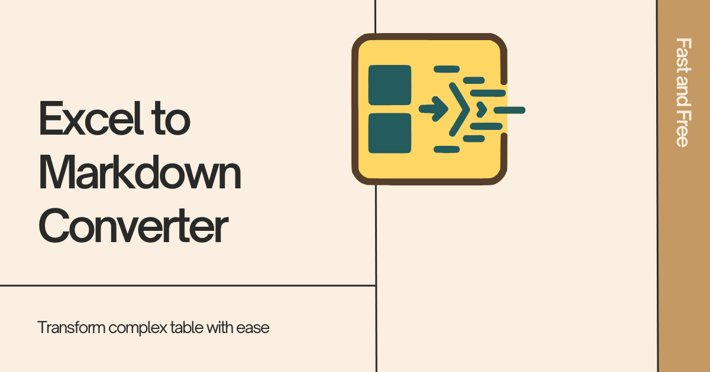

# Excel to Markdown Table Converter



A free, fast, and feature-rich web application to instantly convert Excel table data to clean Markdown format. Perfect for developers, writers, and anyone who works with tables in Markdown documents.

## Features

- **Instant conversion**: Convert Excel or Word tables to Markdown format in real-time
- **Live preview**: See your table formatted as HTML while you type
- **Unicode support**: Full support for special characters, emojis, and mathematical symbols
- **Responsive design**: Works perfectly on desktop, tablet, and mobile devices
- **Privacy focused**: All processing happens in your browser - no data sent to servers
- **Accessible**: Built with accessibility best practices and ARIA labels
- **Modern UI**: No clutter, clean design
- **No registration**: Use immediately without creating an account

## Technology Stack

- **Frontend**: Vanilla JavaScript (ES6+)
- **Styling**: CSS3 with CSS Grid and Flexbox
- **Dependencies**: `markdown-table` library from ESM
- **Fonts**: Space Grotesk & JetBrains Mono
- **Build**: No build process required - runs directly in browser

## Quick Start

### Option 1: Use online
Visit the live application at: [Excel to Markdown Converter](https://ashonko.github.io/excel-to-markdown/)

### Option 2: Run locally

1. **Clone the repository**:
   ```bash
   git clone https://github.com/yourusername/excel-table-to-md.git
   cd excel-table-to-md
   ```

2. **Open in browser**:
   - Simply open `index.html` in your web browser
   - Or serve with a local server:
   ```bash
   # Using Python
   python -m http.server 8000
   
   # Using Node.js
   npx serve .
   
   # Using PHP
   php -S localhost:8000
   ```

3. **Start converting**:
   - Paste your Excel data into the input field
   - See the live preview update automatically
   - Click "Convert to Markdown" to generate the output
   - Copy the result to your clipboard

## How to Use

### Step 1: Copy data from Excel/Word
1. Select your table data in Excel or Word
2. Copy it to clipboard (Ctrl/Cmd + C)

### Step 2: Paste into converter
1. Paste the data into the "Excel Data" field
2. Watch the live HTML preview update automatically

### Step 3: Convert and copy
1. Click "Convert to Markdown" button
2. Copy the generated Markdown from the output field
3. Use it in your Markdown documents!

### Example input:
```
Name	Age	City
John	25	New York
Jane	30	Los Angeles
Bob	35	Chicago
```

### Example output:
```markdown
| Name | Age | City        |
| ---- | --- | ----------- |
| John | 25  | New York    |
| Jane | 30  | Los Angeles |
| Bob  | 35  | Chicago     |
```

## Special features

### Character normalization
The app automatically normalizes common problematic characters from Excel:
- En-dash (–) and em-dash (—) → regular hyphen (-)
- Smart quotes (' ' " ") → standard quotes
- Ellipsis (…) → three dots (...)
- Non-breaking spaces → regular spaces

### Emoji & Unicode support
Full support for emojis and Unicode characters
- 😀 Basic emojis
- 👨‍💻 Complex emojis with skin tones
- α β Mathematical symbols
- ≥ ≤ ± ∞ Special characters

### Keyboard shortcuts
- **Ctrl/Cmd + Enter**: Convert to Markdown
- **Tab**: Navigate between fields
- **Escape**: Clear focus


## Project Structure

```
excel-table-to-md/
├── index.html          # Main HTML file
├── style.css           # Comprehensive CSS
├── script.js           # JavaScript functionality
├── images/
│   ├── favicon.png     # App icon
│   ├── favicon-16x16.png
│   ├── favicon-32x32.png
│   └── feature-image.png # Main feature image
└── README.md           # This file
```

## Browser Support

- **Chrome**: 90+
- **Firefox**: 88+
- **Safari**: 14+
- **Edge**: 90+
- **Mobile**: iOS Safari 14+, Chrome Mobile 90+

## API Reference

### Core functions

#### `parseInputData(inputText)`
Parses tab-separated input data and normalizes special characters.

**Parameters:**
- `inputText` (string): Raw input from Excel/Word copy-paste

**Returns:**
- Array of arrays representing table rows and columns

#### `convertToMarkdown()`
Converts parsed data to markdown table format using the markdown-table library.

#### `createTablePreview(data)`
Generates live HTML table preview for visual feedback.

**Parameters:**
- `data` (array): Parsed table data

## Contributing

Contributions are welcome! Here's how you can help:

1. **Fork the repository**
2. **Create a feature branch**: `git checkout -b feature/amazing-feature`
3. **Commit your changes**: `git commit -m 'Add amazing feature'`
4. **Push to the branch**: `git push origin feature/amazing-feature`
5. **Open a Pull Request**

### Development guidelines
- Follow existing code style and formatting
- Add comments for complex functionality
- Test on multiple browsers and devices
- Ensure accessibility compliance

## License

This project is licensed under the MIT License.

## Credits

- **Developer**: [Rajib Biswas](https://drrajibbiswas.com/)
- **Dependencies**: [markdown-table](https://github.com/wooorm/markdown-table) by Titus Wormer
- **Fonts**: Google Fonts (Space Grotesk, JetBrains Mono)

## Links

- **Live Demo**: [Excel to Markdown Converter](https://ashonko.github.io/excel-to-markdown/)
- **Developer Website**: [drrajibbiswas.com](https://drrajibbiswas.com/)
- **Report Issues**: [GitHub Issues](https://github.com/yourusername/excel-table-to-md/issues)